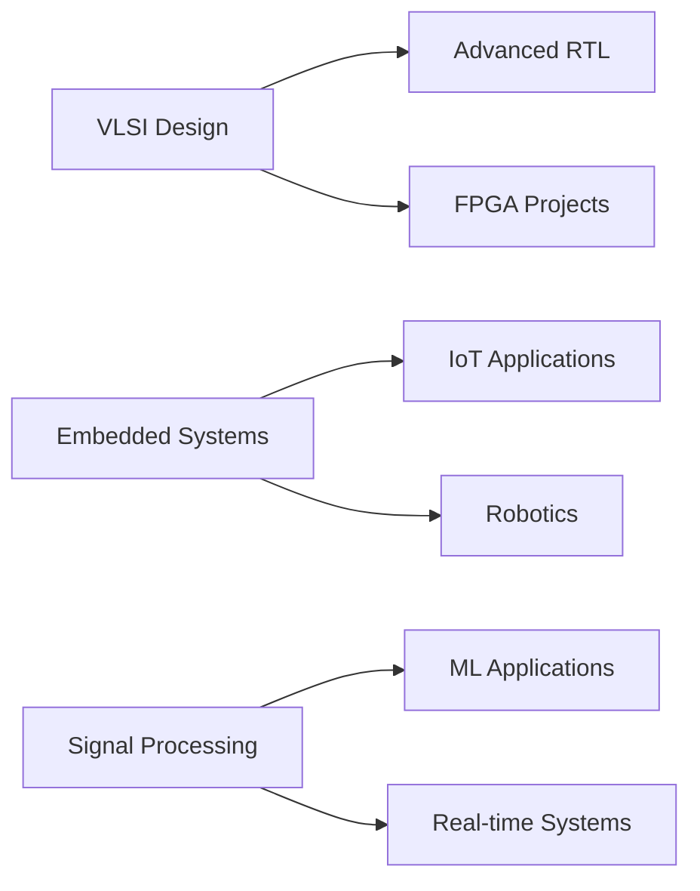

<div align="center">

# 🌊 Hey there! I'm Hariharan 👋


[](mailto:hariharan.t.2007@gmail.com)
[](tel:+917305325266)

</div>

---

## 🎯 About Me

```python
class Hariharan:
    def __init__(self):
        self.username = "T-Hariharan"
        self.education = "BTech ECE @ VIT Vellore"
        self.cgpa = 9.61  # Out of 10.0 💪
        self.specialization = ["VLSI Design", "Embedded Systems", "Digital Electronics"]
        self.current_focus = "Building the future, one chip at a time"
        self.achievements = ["SignalQuest Finalist @ IIT Madras Shaastra 2026 🏆"]
        
    def say_hi(self):
        print("Thanks for dropping by! Let's build something amazing together!")

me = Hariharan()
me.say_hi()
```

<div align="center">

### 🎓 Academic Excellence
**CGPA: 9.61/10.0** | VIT Vellore | ECE | Class of 2028

</div>

---

## 🛠️ Tech Arsenal

<div align="center">

### 💻 Languages & HDLs


### 🔧 Design & Simulation Tools


### ⚡ Hardware Expertise


</div>

---

## 🚀 Featured Projects

### 🔢 16-bit Vedic Multiplier with MAC
```verilog
// High-speed arithmetic meets ancient wisdom
module vedic_multiplier_16bit (
    input [15:0] a, b,
    output [31:0] product
);
// RTL magic happens here ✨
endmodule
```
- 🎯 **Tech Stack:** Verilog HDL, ModelSim
- ⚡ Optimized arithmetic operations using Vedic mathematics
- 🔍 Full RTL design, simulation & verification

### 🫀 ECG Arrhythmia Detection System
```python
# Saving lives with AI 💙
model = CNN_Model()
accuracy = model.train(ecg_signals)
print(f"Diagnostic Accuracy: {accuracy}%")
```
- 🧠 **Tech Stack:** Python, CNN, Deep Learning
- 🎯 Automated cardiac anomaly detection
- 📊 Advanced signal preprocessing & classification

### 🤖 Smart Robotic Car with Autonomous Navigation
```cpp
// Intelligence on wheels 🚗
if (obstacle_detected) {
    avoid_collision();
    recalculate_path();
}
```
- 🎮 **Tech Stack:** Arduino, Bluetooth, Ultrasonic & IR Sensors
- 🧭 Real-time obstacle avoidance & path planning
- 📡 Wireless control with autonomous decision-making

### 📡 Arduino-Based Radar System
```processing
// Seeing the invisible 👁️
void draw() {
    visualize_object_distance();
    update_radar_sweep();
}
```
- 🎯 **Tech Stack:** Arduino, Ultrasonic Sensor, Servo Motor, Processing
- 📊 Real-time object detection & visualization
- 🎨 Custom GUI for distance measurements

---

## 🏆 Achievements & Certifications

<div align="center">

| 🎖️ Achievement | 📍 Organization | 📅 Date |
|---------------|----------------|---------|
| **SignalQuest Finalist** (Round 2) | IIT Madras - Shaastra 2026 | January 2026 |
| **Hardware Modeling using Verilog HDL** | NPTEL (IIT) | September 2025 |

</div>

---

## 📊 GitHub Stats

<div align="center">


</div>

<div align="center">

[](https://git.io/streak-stats)

</div>

---

## 🎯 Current Focus



- 🔬 Deepening VLSI design expertise
- 🤖 Exploring advanced embedded systems
- 🧠 Integrating ML with hardware solutions
- 🏗️ Building scalable FPGA architectures

---

## 💭 Philosophy

<div align="center">

> *"Hardware is the poetry of precision, Software is the song of logic,*  
> *Together they create the symphony of innovation."*  
> **— Every Engineer Ever**

</div>

---

## 📫 Let's Connect!

<div align="center">

[](https://linkedin.com/in/YOUR_LINKEDIN)
[](https://github.com/YOUR_GITHUB_USERNAME)
[](mailto:hariharan.t.2007@gmail.com)

### 💡 Open to collaborations, internships, and innovative projects!

---


**⭐ From [Hariharan](https://github.com/YOUR_GITHUB_USERNAME) with 💙**

</div>
